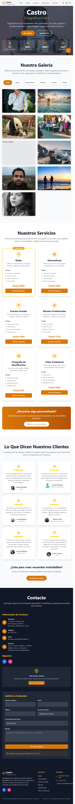

# Portafolio Castro

¡Bienvenido al portafolio profesional de Castro!  
Este proyecto está construido con tecnologías modernas como **React**, **TypeScript**, **Vite** y **Tailwind CSS**, y sirve como una carta de presentación web, visualmente atractiva, rápida y totalmente responsive.

---

## 📸 Demo

<!-- Agrega aquí tus capturas reales -->



---

## 🚀 Tecnologías utilizadas

- 🛠️ [Vite](https://vitejs.dev/) — Bundler ultrarrápido
- ⚛️ [React](https://reactjs.org/)
- 📘 [TypeScript](https://www.typescriptlang.org/)
- 💨 [Tailwind CSS](https://tailwindcss.com/)
- 🌟 [Lucide React](https://lucide.dev/) — Iconos modernos

---


## ⚙️ Instalación

1. Clona el repositorio:

```bash
git clone https://github.com/axlRoman/portafolioCastro
cd portafolioCastro
```
2. Instala dependencias:
```bash
npm install
```
3. Inicia el servidor de desarrollo:
```bash
npm run dev
```
Accede en tu navegador a `http://localhost:5173`.

---
🧪 Scripts disponibles
| Comando       | Descripción                     |
| :------------ | :------------------------------ |
| `npm run dev`   | Inicia el entorno de desarrollo |
| `npm run build` | Genera la versión de producción |
| `npm run preview` | Previsualiza la build local     |
| `npm run lint`  | Ejecuta ESLint                  |

## 📄 Licencia y autor

> **Autor:** Francisco Axel Roman Cardoza  
> GitHub: [@axlRoman](https://github.com/axlRoman)  
>
> **Licencia:** Uso personal y educativo. Puedes reutilizar el código con atribución.
